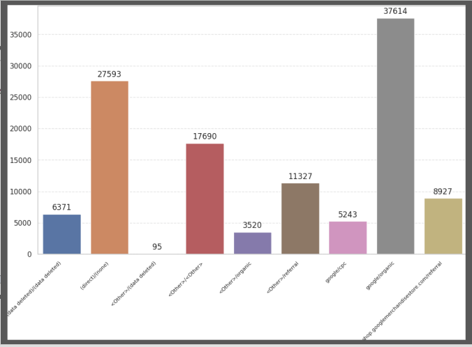
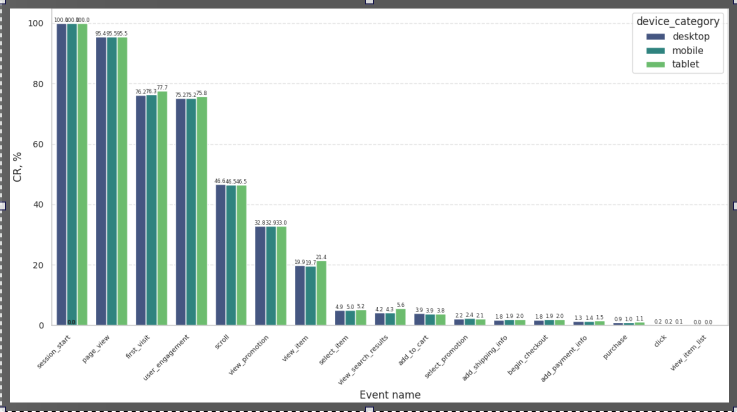
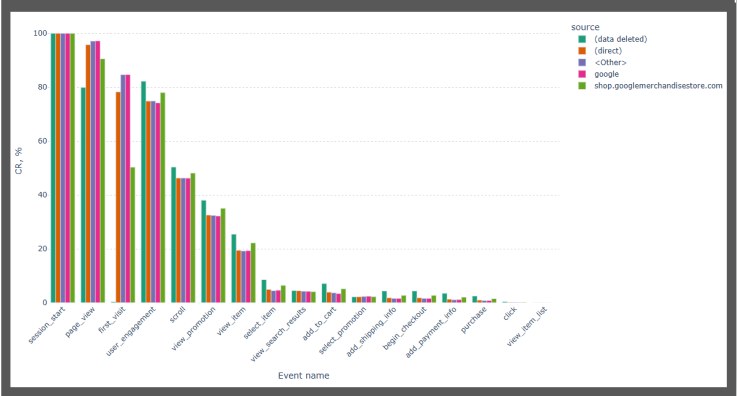

# E-commerce_Conversion_Funnel-BigQuery_and_Google_Colab_Project 🚀
 
Welcome! This repository showcases an e-commerce data analysis project powered by BigQuery and Google Colab.

## Data Source Description 📂

The data source is the BigQuery GA4 public dataset: 'bigquery-public-data.ga4_obfuscated_sample_ecommerce.events_2021*', which provides data for January 2021. The dataset consists of 1,210,147 rows.

## Gallery and Insights 📊 💡

### General

Total number of sessions 116,514 , total number of purchase 1204, CR = 1.03%.

### 1. Sessions and Purchases Distribution by Country.


With over 52,000 sessions, the USA significantly outperforms all other countries. Engagement across the African continent remains minimal. Google serves as the primary traffic source for the majority of countries.

### 2. Sessions Distribution by Source/Medium.


Traffic from unpaid search results on Google lead with more than 37000 sessions. Traffic from users who typed your URL directly where the medium is not explicitly defined takes second place.

### 3. CR by Event and Device Category.


CR from session_start to add_to_cart( ~3.9%) is below the market average (5%). Conversions across all device categories are at the same level.

### 4. CR by Event and Source.


Conversion rate across source (data deleted) is higher than others.

### 5. Dynamic Purchase CR by Source/Medium and Its Trend Line.


Traffic wihh (data deleted/data deleted) has higher CR than others. Overall trend line shows slight growth by month-end.

### 6. Purchase CR by Number of Landing Page Visits.


Traffic wihh (data deleted/data deleted) has higher CR than others. Overall trend line shows slight growth by month-end.

### 7. GA4 Ecommerce Event Correlation Matrix.

1) Strong positive correlations (red zones): begin_checkout ↔ add_payment_info (0.85), add_payment_info ↔ purchase (0.84), begin_checkout ↔ purchase (0.72).
2) Correlation add_to_cart ↔ begin_checkout (0.48) is significantly lower than the conversions from point 1.
3) Events view_promotion and select_promotion are barely correlated with purchases (~0.14 and 0.03).
   
## SQL Queries Used in This Project. ⚒️

<details>
<summary><b>Data Extraction from BigQuery and Initial Table Creation.</b></summary>

 ```sql
 SELECT timestamp_micros(event_timestamp) AS event_timestamp,
        user_pseudo_id || '+' || (SELECT value.int_value FROM UNNEST(event_params) WHERE key = 'ga_session_id') AS user_session_id,
        event_name,
        geo.country AS country,
        device.category AS device_category,
        traffic_source.source AS source,
        traffic_source.medium AS medium,
        traffic_source.name AS campaign
 FROM `bigquery-public-data.ga4_obfuscated_sample_ecommerce.events_2021*`
 ORDER BY event_timestamp
```

</details>

####  Creating Pivot Table with Conversion Rate calculation for each funnel event by date and traffic channel:

<details>
<summary>Option 1. Using CASE expression.</summary>

 ```sql
WITH init AS (
      SELECT DATE(TIMESTAMP_MICROS(event_timestamp)) as event_date,
             traffic_source.source AS source,
             traffic_source.medium AS medium,
             traffic_source.name AS campaign,
            user_pseudo_id || (SELECT value.int_value FROM t.event_params  WHERE  key='ga_session_id') AS user_session_id,
            event_name
      FROM  `bigquery-public-data.ga4_obfuscated_sample_ecommerce.events_2021*` t
      )
SELECT event_date,
       source,
       medium,
       campaign,
       COUNT(DISTINCT user_session_id) AS user_sessions_count,
       COUNT(DISTINCT CASE WHEN event_name = 'session_start' THEN user_session_id END) AS session_start,
       COALESCE(COUNT(DISTINCT CASE WHEN event_name = 'add_to_cart' THEN user_session_id END), 0) /
            NULLIF(COUNT(DISTINCT CASE WHEN event_name = 'session_start' THEN user_session_id END), 0) AS add_to_cart,
       COALESCE(COUNT(DISTINCT CASE WHEN event_name = 'begin_checkout' THEN user_session_id END), 0) /
                  NULLIF(COUNT(DISTINCT CASE WHEN event_name = 'session_start' THEN user_session_id END), 0) AS begin_checkout,
       COALESCE(COUNT(DISTINCT CASE WHEN event_name = 'add_shipping_info' THEN user_session_id END), 0) /
                  NULLIF(COUNT(DISTINCT CASE WHEN event_name = 'session_start' THEN user_session_id END), 0) AS add_shipping_info,
       COALESCE(COUNT(DISTINCT CASE WHEN event_name = 'add_payment_info' THEN user_session_id END), 0) /
                  NULLIF(COUNT(DISTINCT CASE WHEN event_name = 'session_start' THEN user_session_id END), 0) AS add_payment_info,
       COALESCE(COUNT(DISTINCT CASE WHEN event_name = 'purchase' THEN user_session_id END), 0) /
                  NULLIF(COUNT(DISTINCT CASE WHEN event_name = 'session_start' THEN user_session_id END), 0) AS purchase
FROM init
GROUP BY event_date, source, medium, campaign
ORDER BY event_date, source, medium
```
</details>

<details>
<summary>Option 2. Using PIVOT operator.</summary>

```sql
SELECT p.event_date,
       p.sourse,
       p.medium,
       p.campaign,
       p.session_start,
       1.0 * COALESCE(p.add_to_cart, 0) / NULLIF(p.session_start, 0) AS add_to_cart,
       1.0 * COALESCE(p.begin_checkout, 0) / NULLIF(p.session_start, 0) AS begin_checkout,
       1.0 * COALESCE(p.purchase, 0) /  NULLIF(p.session_start, 0) AS purchase
FROM
      (SELECT *
       FROM
           (SELECT DATE(TIMESTAMP_MICROS(event_timestamp)) AS event_date,
                   traffic_source.source AS sourse,
                   traffic_source.medium AS medium,
                   traffic_source.name AS campaign,
                   event_name,
                   COUNT(DISTINCT user_pseudo_id || (SELECT value.int_value FROM t.event_params  WHERE  key='ga_session_id')) AS       count_user_session_id
            FROM `bigquery-public-data.ga4_obfuscated_sample_ecommerce.events_2021*` t
            WHERE event_name IN ('session_start', 'add_to_cart', 'begin_checkout', 'purchase')
            GROUP BY event_date, traffic_source.source, traffic_source.medium, traffic_source.name, event_name
           ) e
      PIVOT (SUM(count_user_session_id)
             FOR event_name IN ('session_start', 'add_to_cart', 'begin_checkout', 'purchase'))
      ) p
ORDER BY event_date, sourse, medium
```
</details>

<details>
<summary>Option 3. Applying pivoting through aggregation and CASE expression.</summary>

```sql
SELECT e1.event_date,
       e1.sourse,
       e1.medium,
       e1.campaign,
       MIN(CASE WHEN event_name = 'session_start' THEN count_user_session_id END) AS session_start,
       COALESCE(MIN(CASE WHEN event_name = 'add_to_cart' THEN count_user_session_id END), 0) /
            NULLIF(MIN(CASE WHEN event_name = 'session_start' THEN count_user_session_id END), 0) AS add_to_cart,
       COALESCE(MIN(CASE WHEN event_name = 'begin_checkout' THEN count_user_session_id END), 0) /
            NULLIF(MIN(CASE WHEN event_name = 'session_start' THEN count_user_session_id END), 0) AS begin_checkout,
       COALESCE(MIN(CASE WHEN event_name = 'purchase' THEN count_user_session_id END), 0) /
            NULLIF(MIN(CASE WHEN event_name = 'session_start' THEN count_user_session_id END), 0) AS purchase
FROM (
       SELECT DATE(TIMESTAMP_MICROS(event_timestamp)) AS event_date,
              traffic_source.source AS sourse,
              traffic_source.medium AS medium,
              traffic_source.name AS campaign,
              event_name,
              COUNT(distinct user_pseudo_id || (SELECT value.int_value FROM t.event_params  WHERE  key='ga_session_id')) AS  count_user_session_id
      FROM `bigquery-public-data.ga4_obfuscated_sample_ecommerce.events_2021*` t
      WHERE event_name IN ('session_start', 'add_to_cart', 'begin_checkout', 'purchase')
      GROUP BY event_date, traffic_source.source, traffic_source.medium, traffic_source.name, event_name
     ) e1
GROUP BY event_date, sourse, medium, campaign
ORDER BY event_date,sourse, medium
```
</details>

<details>
<summary><b>Comparison of Conversion Rates across different landing pages.</b></summary>

```sql
WITH first_table AS (
      SELECT DISTINCT user_pseudo_id || (SELECT value.int_value FROM UNNEST(event_params) WHERE key = 'ga_session_id') AS user_session_id,
             '/' || REGEXP_EXTRACT((SELECT value.string_value FROM UNNEST(event_params) WHERE key = 'page_location'),
                    r'^https?://[^/]+/([^?#]*)') AS page_path,
              ROW_NUMBER() OVER (PARTITION BY user_pseudo_id ||
                    (SELECT value.int_value FROM UNNEST(event_params) WHERE key = 'ga_session_id') ) AS rn
      FROM `bigquery-public-data.ga4_obfuscated_sample_ecommerce.events_2021*`
      WHERE event_name = 'session_start'
                    )
, init AS (
      SELECT user_session_id,
             page_path
      FROM first_table
      WHERE rn = 1
          )
--relate session_start pages with purchases via user_session_id
, purch_users AS (
      SELECT page_path,
             user_session_id
      FROM init
      WHERE user_session_id IN (SELECT user_pseudo_id || (SELECT value.int_value FROM UNNEST(event_params) WHERE key = 'ga_session_id')
                                FROM `bigquery-public-data.ga4_obfuscated_sample_ecommerce.events_2021*`
                                WHERE event_name = 'purchase'
                                )
                 )
--count landing pages
, start_users_count AS (
      SELECT page_path,
             COUNT(DISTINCT user_session_id) AS start_event
      FROM init
      GROUP BY page_path
      )
--count the number of purchases by page
, purchers_users_count AS (
      SELECT page_path,
             COUNT(DISTINCT user_session_id ) AS purchase_event
      FROM purch_users
      GROUP BY page_path
                          )
--connect the table of the number of page_paths in session_start with the table of the number of purchases in the session that started with the given page_path..
SELECT s.page_path,
       s.start_event,
       COALESCE(p.purchase_event, 0) AS purchase_event,
       COALESCE(p.purchase_event, 0) / NULLIF(s.start_event, 0) AS cr
FROM start_users_count s
LEFT JOIN purchers_users_count p 
ON s.page_path = p.page_path
ORDER BY p.purchase_event DESC, s.page_path ASC
```
</details>

<details>
<summary><b>Counting purchase conversion correlation with engagement time and the presence of engagement in a session..</b></summary>

```sql
WITH user_sessions AS (
     SELECT user_pseudo_id ||
                 CAST((SELECT value.int_value FROM UNNEST(event_params) WHERE key = 'ga_session_id') AS string) AS user_session_id,
            SUM(COALESCE((SELECT value.int_value FROM UNNEST(event_params) WHERE key = 'engagement_time_msec'), 0))
                 AS total_engagement_time,
            CASE
                 WHEN SUM(COALESCE(SAFE_CAST(
                             (SELECT value.string_value FROM unnest(event_params) where key = 'session_engaged') as integer), 0)) > 0
                 THEN 1
                 ELSE 0
            END AS is_session_engaged
    FROM `bigquery-public-data.ga4_obfuscated_sample_ecommerce.events_2021*` e
    GROUP BY 1
),
purchases AS (
    SELECT user_pseudo_id ||
                 CAST((SELECT value.int_value FROM e.event_params WHERE key = 'ga_session_id') AS string) AS user_session_id
    FROM `bigquery-public-data.ga4_obfuscated_sample_ecommerce.events_2021*` e
    WHERE event_name = 'purchase'
    GROUP BY user_session_id
)
SELECT
    CORR(s.total_engagement_time, CASE WHEN p.user_session_id IS NOT NULL THEN 1 ELSE 0 END) AS engagement_time_to_purchase_corr,
    CORR(s.is_session_engaged, CASE WHEN p.user_session_id IS NOT NULL THEN 1 ELSE 0 END) AS engaged_session_to_purchase_corr,
FROM user_sessions s
LEFT JOIN purchases p 
ON s.user_session_id = p.user_session_id
```
</details>

## Feedback and Collaboration 🙌

If you have any feedback regarding the code, or visualization choices, please open an issue or reach out to me directly. I'm also open to collaboration and welcome any contributions that could enhance the report's functionalities!
